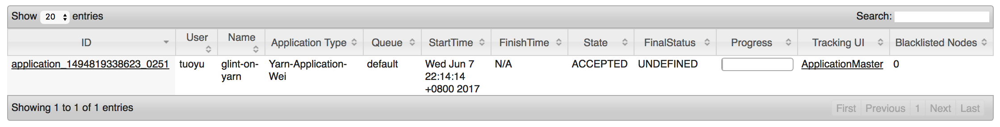
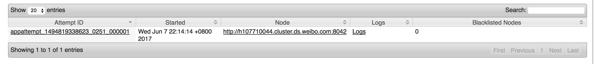
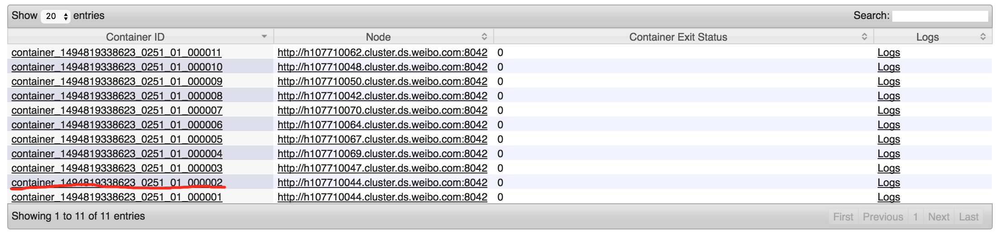

# Yarn Support for Glint

This package code is to help glint running on Hadoop Yarn as an Yarn Application.

## How to use it

* Start on Yarn script on path $worksapce/sbin/stasrt-on-yarn.sh. And there are three arguments for this script.
	* **-H**	HDFS PATH, this argument will be used as Yarn Application dir, Glint jar package will be upload to this path
	* **-c**	Glint config file as other part
	* **-n**	Glint Master and Server intances number


* example
	```language=scala
    	sh sbin/start-on-yarn.sh -n 10 -H hdfs://10.77.100.41:9000/user/tuoyu -c glint.conf
	```
* There are some other parameters for Yarn Application and Yarn Containers, you can find them in glint.conf file which localtion is under resources file.
* The Application will choose the first Yarn container as Glint Master and other containers will be registed themselves as Glint server. And you can find it in your Yarn Page. The Glint Master will be located on the second Yarn Container, and this container's hostname will be the master hostname.
	* For example, it is my yarn application.
	
    * And please check the Application Defail Page
    
	* And this container will run Glint Master, and you can specific this hostname as master host(h107710044.cluster.ds.weibo.com).
	
